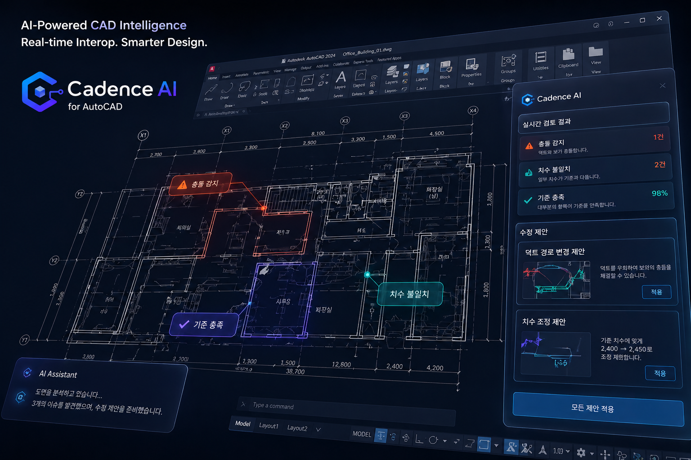

<br>

# <div align="center"> **<span style="color: #0162e0;">Cadence AI</span>: Enterprise CAD-sLLM 자동화 플랫폼** </div>

<div align="center">



<br>

**"기업의 설계 자산, 이제 AI가 검토하고 실시간으로 소통합니다."**

</div>

<br><br>

# 1. 팀 소개 
## ✦ 팀 명 : **Cadence AI** 

<div align="center">
  <table width="100%" style="border-collapse: collapse; text-align: center; font-size: 14px; margin: auto; table-layout: fixed;">
  <tr>
      <td width="20%" align="center" style="border: 1px solid #ddd; padding: 10px; vertical-align: middle;">
        
      </td>
      <td width="20%" align="center" style="border: 1px solid #ddd; padding: 10px; vertical-align: middle;">
        
      </td>
      <td width="20%" align="center" style="border: 1px solid #ddd; padding: 10px; vertical-align: middle;">
        
      </td>
      <td width="20%" align="center" style="border: 1px solid #ddd; padding: 10px; vertical-align: middle;">
        
      </td>
      <td width="20%" align="center" style="border: 1px solid #ddd; padding: 10px; vertical-align: middle;">
        
      </td>
  </tr>
  <tr style="background-color: #f9f9f9; font-weight: bold;">
    <td style="border: 1px solid #ddd; padding: 8px;">양창일</td>
    <td style="border: 1px solid #ddd; padding: 8px;">김다빈</td>
    <td style="border: 1px solid #ddd; padding: 8px;">김지우</td>
    <td style="border: 1px solid #ddd; padding: 8px;">송주엽</td>
    <td style="border: 1px solid #ddd; padding: 8px;">김민정</td>
  </tr>
  <tr style="background-color: #ffffff; font-weight: bold;">
    <td style="border: 1px solid #ddd; padding: 8px; color: #555;"><span style="font-size: 13px; font-weight: bold;">PM/AI/BE</span></td>
    <td style="border: 1px solid #ddd; padding: 8px; color: #555;"><span style="font-size: 13px; font-weight: bold;">APM/AI/BE</span></td>
    <td style="border: 1px solid #ddd; padding: 8px; color: #555;"><span style="font-size: 13px; font-weight: bold;">AI/BE/FE</span></td>
    <td style="border: 1px solid #ddd; padding: 8px; color: #555;"><span style="font-size: 13px; font-weight: bold;">AI/BE/FE/Infra</span></td>
    <td style="border: 1px solid #ddd; padding: 8px; color: #555;"><span style="font-size: 13px; font-weight: bold;">AI/FE</span></td>
  </tr>
  <tr>
    <td style="border: 1px solid #ddd; padding: 12px 10px; color: #555; vertical-align: top;">
          <div style="font-size: 10px; text-align: left; line-height: 1.5;">
              - 프로젝트 총괄 및 기획<br>
              - vLLM 추론 엔진 최적화<br>
              - 소방 에이전트 설계<br>
          </div>
    </td>
    <td style="border: 1px solid #ddd; padding: 12px 10px; color: #555; vertical-align: top;">
          <div style="font-size: 10px; text-align: left; line-height: 1.5;">
              - 건축 에이전트 설계<br>
              - Autocad Plugin 설계 및 구현<br>
              - 프로젝트 산출물 및 문서 총괄
          </div>
    </td>
    <td style="border: 1px solid #ddd; padding: 12px 10px; color: #555; vertical-align: top;">
          <div style="font-size: 10px; text-align: left; line-height: 1.5;">
              - C# ↔ Python Interop 설계<br>
              - 전기 에이전트 설계<br>
              - AutoCAD UI/UX/Plugin 설계 및 구현<br>
          </div>
    </td>
    <td style="border: 1px solid #ddd; padding: 12px 10px; color: #555; vertical-align: top;">
          <div style="font-size: 10px; text-align: left; line-height: 1.5;">
              - AWS 클라우드 인프라 설계<br>
              - Docker & AWS 배포<br>
              - 배관 에이전트 설계
          </div>
    </td>
    <td style="border: 1px solid #ddd; padding: 12px 10px; color: #555; vertical-align: top;">
          <div style="font-size: 10px; text-align: left; line-height: 1.5;">
              - WEB UI/UX<br>
              - 소방 에이전트 설계<br>
          </div>
    </td>
  </tr>
  <tr style="background-color: #ffffff;">
    <td align="center" style="border: 1px solid #ddd; padding: 8px;">
        <a href="https://github.com/clachic00"></a>
    </td>
    <td align="center" style="border: 1px solid #ddd; padding: 8px;">
        <a href="https://github.com/tree0327"></a>
    </td>
    <td align="center" style="border: 1px solid #ddd; padding: 8px;">
        <a href="https://github.com/jooooww"></a>
    </td>
    <td align="center" style="border: 1px solid #ddd; padding: 8px;">
        <a href="https://github.com/JUYEOP024"></a>
    </td>
    <td align="center" style="border: 1px solid #ddd; padding: 8px;">
        <a href="https://github.com/minjeong-kim-dev"></a>
    </td>
  </tr>
</table>

</div>

<br><br>

# 2. 프로젝트 개요
### ✦ 프로젝트 소개
**Project Cadence AI**는 기업 내부의 설계 노하우와 전문 법규(KEC, NFSC 등) 데이터를 학습한 **자체 sLLM(Qwen3.5-27B)**을 기반으로, AutoCAD 도면의 정합성을 실시간으로 검토하는 **B2B 엔지니어링 자동화 솔루션**입니다. C# 플러그인 환경 내 WebView2와 Python 에이전트의 유기적인 결합을 통해 도면의 법규 위반을 탐지하고, 한 번의 클릭으로 자동 수정(AutoFix)하여 설계자의 업무를 혁신적으로 단축합니다.

### ✦ 프로젝트 필요성 (배경)
1. **전문 인력 부족 및 휴먼 에러**: 숙련된 설계 검토자의 부족으로 인한 검토 누락 및 대형 법규 위반 리스크.
2. **비정형 데이터의 한계**: 수만 개의 도면 객체(Entity)와 수천 페이지의 텍스트 시방서를 대조하는 과정에서의 막대한 리소스 낭비.
3. **지식 자산화의 부재**: 기업별/프로젝트별로 파편화된 검토 기준과 가이드라인을 AI 모델에 내재화하여 일관된 퀄리티 컨트롤 필요.

<br><br>

# 3. 비즈니스 이해
* **타겟 고객**: 건설사, 엔지니어링사, 설계 사무소 등 대규모 CAD 도면 및 법규 검토가 필수적인 B2B 기업.
* **핵심 가치 (Value Proposition)**: 
    * **Cost Reduction**: 수동 검토 대비 업무 시간 및 인건비 대폭 절감.
    * **Risk Management**: RAG 기반 최신 법규 자동 대조를 통해 설계 결함 및 재시공 비용(Rework) 예방.
    * **Security & Multi-tenancy**: 기업 조직(Org_id) 기반 격리 데이터베이스 운영 및 로컬 sLLM 환경 구축으로 완벽한 도면 보안 보장.

<br><br>

# 4. 프로젝트 목표
1. **고성능 sLLM 서빙 아키텍처**: 27B 파라미터급 모델의 실시간 탐지를 위해 vLLM 추론 엔진 도입으로 Latency 최소화.
2. **공간 데이터 특화 RAG 인프라**: PostgreSQL(pgvector)을 활용한 하이브리드 검색 및 AutoCAD 기하학 데이터를 위한 Custom BoxType 적용.
3. **상태(State) 중심의 LangGraph 오케스트레이션**: 복잡한 워크플로우를 통제하고 안정적인 구조화 출력(Structured Output)을 위한 Pydantic 스키마 검증 시스템 구축.

<br><br>

# 5. AI Strategy & Pipeline
도면이라는 **비정형 공간 데이터**를 AI가 이해하고 최신 법규와 대조할 수 있도록 고도화된 백엔드 및 추론 전략을 채택했습니다.

### ✦ sLLM & vLLM 서빙 엔진
실시간 탐지가 필수적인 CAD 환경에서 Cold Start(수십 초 대기)가 발생하는 서버리스 아키텍처를 과감히 배제하고, 처리량(Throughput)이 극대화된 **vLLM 전용 인스턴스**를 채택했습니다.
* **Model**: 전문 지식 SFT 파인튜닝이 적용된 **Qwen3.5-27B**.
* **PagedAttention**: KV 캐시의 메모리 파편화를 0%에 가깝게 줄여 동시 처리량 최대 24배 증가.
* **Continuous Batching**: 런타임 빈 공간에 실시간으로 요청을 끼워 넣어 GPU 가동률 극대화.

### ✦ 고성능 RAG 인프라 (PostgreSQL + pgvector)
단순한 텍스트 검색을 넘어 공간/의미 기반 검색을 동시 지원하는 DB 아키텍처를 설계했습니다.
* **하이브리드 검색**: 의미 기반의 Dense 검색(pgvector HNSW 인덱스)과 키워드 기반의 Sparse 검색(JSONB GIN 인덱스) 병행.
* **Custom BoxType**: 도면 내 객체 위치를 빠르게 식별하기 위해 기하학적 커스텀 타입을 정의.
* **계층형 컨텍스트 관리**: Chat Session 내역을 단순 저장이 아닌 **Recursive Summary** 방식으로 압축하여 LLM 컨텍스트 윈도우 비용 절감.

### ✦ LangGraph & Pydantic 스키마 검증
엔지니어링 툴의 핵심인 '안정성'을 확보하기 위해 에이전트의 출력을 강력하게 통제합니다.
* 자유분방한 LLM의 출력을 제어하기 위해 LangGraph의 `with_structured_output`과 **Pydantic(BaseModel)**을 결합.
* 필수 필드 누락이나 타입 오류를 사전에 차단하여 에이전트 워크플로우의 상태(State) 오염 방지 및 AutoFix의 정확성 보장.

<br><br>

# 6. 주요 기능
* **실시간 도면 분석 (AutoCAD Native UI)**: AutoCAD 내장 WebView2를 통해 다크 테마(Dark Mode)의 챗봇 및 정밀 데이터 그리드 기반 위반 목록 패널 제공.
* **Handle & Violation 매핑**: B-Tree 인덱스로 식별된 객체 Handle과 위반 코드를 매핑하여, 목록 클릭 시 도면 내 해당 위치로 즉시 Zoom-in.
* **원클릭 자동 수정 (AutoFix)**: 분석된 JSON 가이드라인을 C# 플러그인으로 전달하여 치수 변경, 레이어 이동, 수정 구름(RevCloud) 자동 생성.
* **멀티테넌트 대시보드 (Multi-tenancy)**: 특정 조직(Org_id) 단위로 데이터 접근이 원천 차단되는 보안형 관리자 페이지 제공.

<br><br>

# 7. 프로젝트 설계
### ✦ 시스템 아키텍처
* **C# Plugin** (Data Extraction) <-> **FastAPI** (LangGraph Logic) <-> **vLLM** (Qwen3.5-27B) <-> **React 19** (WebView2 Control)


### ✦ 파일 구조
```plaintext
SKN23-FINAL-2TEAM/
├── backend/                # FastAPI 메인 백엔드
│   ├── api/                # REST API 라우터
│   ├── core/               # DB 연결 (pgvector), 보안(Org_id)
│   ├── models/             # SQLAlchemy ORM (Custom BoxType 포함)
│   ├── services/           
│   │   ├── agents/         # LangGraph 기반 에이전트 (Pydantic 스키마 검증)
│   │   │   ├── call_review_agent/ # 툴콜 성능/정확도 평가 에이전트
│   │   ├── cad_service.py  # CAD 데이터 (Handle/Layer) 파싱
│   │   └── llm_service.py  # vLLM 인스턴스 통신
├── frontend/               # React 19 + Tailwind CSS v4 (WebView2 UI)
│   ├── src/
│   │   ├── components/     # Main Chat & Violation Pane
│   │   ├── store/          # Zustand 상태 관리
│   │   └── hooks/          # WebSocket (실시간 스트리밍)
├── CadSllmAgent/           # AutoCAD C# 플러그인 (AutoFix 기능)
├── data/                   # 법규, SFT 파인튜닝 데이터
└── docs/                   # 아키텍처 및 KPI 평가(Ragas) 문서
```

<br><br>

# 8. 데이터셋
* **전문 법규 데이터**: 국가건설기준(KDS), 한국전기설비규정(KEC), 국가화재안전기준(NFSC) 벡터 DB화.
* **도면-텍스트 매핑 데이터**: SFT(지도 학습)를 위한 도면 객체 ↔ 구조적 텍스트(JSON) 쌍 데이터.
* **임시 시방서**: 기업별 맞춤형 룰 체크를 위한 PDF 기반 실시간 청크 데이터.

<br><br>

# 9. 기술 스택
### ✦ Frontend (AutoCAD WebView2)
    

### ✦ Backend
  

### ✦ AI & LLM Engine
   

### ✦ Database & Storage
  

### ✦ Plugin Development
 

<br><br>

# 10. 트러블슈팅
* **Issue 1: 27B 대규모 모델 서버리스 구동 시 발생하는 OOM 및 Cold Start 문제**
    * *Symptom*: VRAM 메모리 파편화로 인해 도면 분석 요청 시 응답까지 수 분 대기 발생(UX 치명적 저하).
    * *Solution*: Serverless 방식을 배제하고 **vLLM(PagedAttention) 전용 인스턴스 구축**. 메모리 파편화 방지 및 Continuous Batching을 통해 처리량(Throughput) 압도적 개선.
* **Issue 2: 복잡한 툴 콜(Tool Call) 단계에서 발생하는 상태(State) 오염 문제**
    * *Symptom*: LangGraph 워크플로우 진행 중 LLM이 자유로운 형태의 String을 뱉어 시스템 에러 유발.
    * *Solution*: **Pydantic 스키마**를 상속받은 `with_structured_output`을 통해 LLM 응답 포맷을 강제로 통제하여 안정성 확보.
* **Issue 3: 단순 벡터 탐색의 한계(도면 좌표 기반 위치 정보 유실)**
    * *Symptom*: 법규 텍스트는 찾았으나 실제 도면의 객체 위치 식별 난항.
    * *Solution*: PostgreSQL에 기하학적 형태를 다룰 수 있는 **Custom BoxType** 컬럼 및 B-Tree 인덱스(Handle 식별자) 적용으로 공간 검색 최적화.

<br><br>

# 11. 향후 개선 계획
* **에이전트 정확도 평가 고도화**: Ragas 프레임워크를 도입하여 Call Review 에이전트의 Recall(재현율) 및 Tool Call 적합성 KPI 수치 측정 파이프라인 자동화.
* **도메인 확장**: 건축, 전기를 넘어 기계, 토목, 소방 도메인 파서 추가 개발 및 도메인 특화 모델 미세조정(SFT).
* **UI/UX 고도화**: 피그마 디자인 시스템을 완벽 반영하여, 엔지니어링 툴 고유의 Dark Mode 환경에서 위반 객체 식별률을 극대화하는 정밀 데이터 그리드 제공.

<br><br>

# 12. 인사이트
* B2B AI 솔루션의 성패는 모델의 크기가 아니라, LLM 서빙 엔지니어링(vLLM)을 통한 **"실제 사용자 Latency 확보"**와 LangGraph 기반의 **"통제 가능한 아키텍처 설계"**에 있음을 확인했습니다.
* 실무자의 워크플로우를 파괴하지 않으면서도 시스템 보안(Multi-tenancy)을 확보하는 **플러그인-DB 연동 설계**가 실제 엔터프라이즈 도입 문턱을 낮추는 핵심입니다.

<br><br>

# 13. 한 줄 회고
| 팀원 | 한 줄 회고 |
| :---: | :--- |
| **양창일** | 인프라와 AI의 결합을 통해 실질적인 업무 자동화의 가능성을 보았습니다. |
| **김다빈** | 복잡한 건축 법규를 코드와 프롬프트로 녹여내는 과정이 매우 도전적이었습니다. |
| **김지우** | Autocad에 확장프로그램을 추가하는 경험을 통해 개발 역량을 키울 수 있었습니다.|
| **송주엽** | 도면 객체의 논리적 연결을 구현하며 CAD 데이터의 심오함을 느꼈습니다. |
| **김민정** | 사용자 경험과 AI의 성능 사이의 균형점을 찾는 소중한 경험이었습니다. |

<br><br>

# 14. How to Run

### ✦ Backend (FastAPI)
1. Python 3.10+ 환경을 준비합니다.
2. 가상환경 생성 및 활성화:
   ```bash
   python -m venv venv
   source venv/bin/activate  # Windows: venv\Scripts\activate
   ```
3. 필수 패키지 설치:
   ```bash
   pip install -r requirements.txt
   ```
4. `.env` 파일 설정 (API Key, DB URL 등).
5. 서버 실행:
   ```bash
   uvicorn backend.app:app --reload
   ```

### ✦ Frontend (React)
1. Node.js 18+ 환경을 준비합니다.
2. 의존성 패키지 설치:
   ```bash
   cd frontend
   npm install
   ```
3. 개발 서버 실행:
   ```bash
   npm run dev
   ```

### ✦ AutoCAD Plugin (C#)
1. Visual Studio에서 `CadSllmAgent.sln`을 엽니다.
2. 빌드 후 AutoCAD에서 `NETLOAD`로 `.dll` 로드.